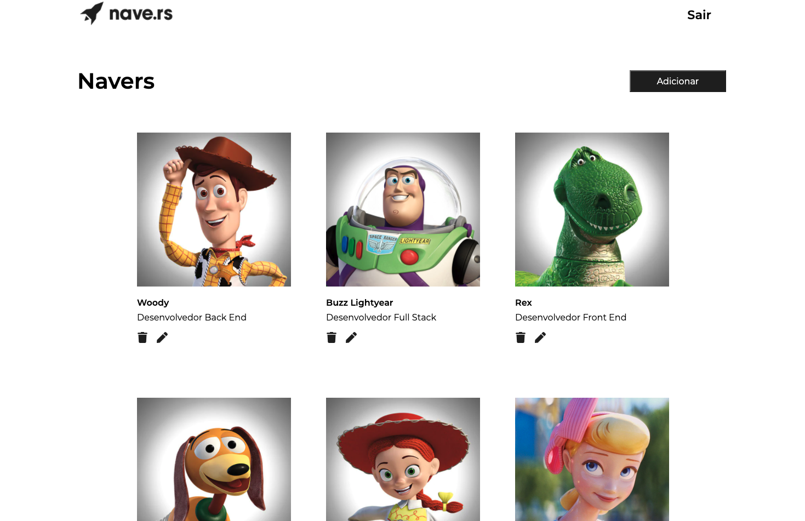
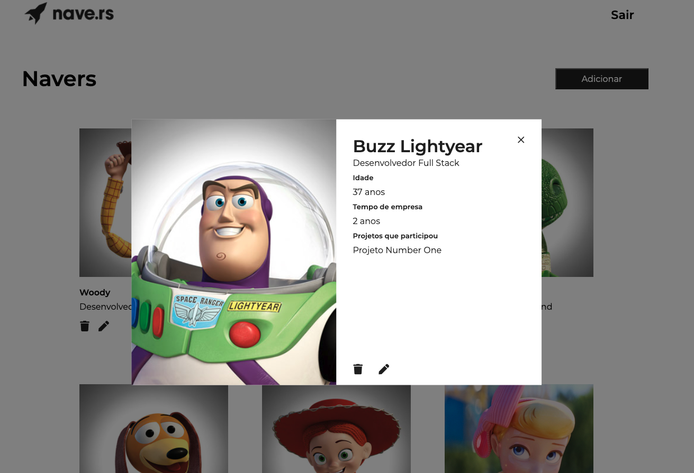

<h1>  NaveDex </h1>

## Descrição do Projeto:

Trata-se de uma aplicação web responsiva com autenticação de users e CRUD de membros da Nave.rs, temos o Dashboard com a visão geral dos membros cadastrados com exibição do Nome e cargo, e ícones, animados para um melhor feedback para o usuário, para excluir o profile ou edita-lo. Em todas as ações de criação, edição e exclusão há feedbacks de sucesso para o usuário. Ao clicar na imagem de um naver cadastrado, é exibido em um modal maiores informações sobre ele, como  nome, cargo, idade, tempo de empresa e projetos no qual fez parte. 


<br/>




## Tecnologias utilizadas:

- React 

- Hooks

- Styled Components

- API

- axios
 
## Como inicializar o projeto:

Clone  o repositório: 
```
 git clone https://github.com/M3nozzi/frontend_nave.git
```
Instale os pacotes
```
 yarn install ou npm install
```

Execute o projeto:
```
yarn start ou npm start
```
No browser acessar a aplicação:
```
http://localhost:3000
```
Para fazer o login, utilize os dados abaixo:
```
login: menozzi@nave.rs
senha: 6789123
```
Exemplo do arquivo .env utilizado no projeto:
```
REACT_APP_KEY=token
```


## Autor

Desenvolvido por [**Fabio Menozzi**](https://www.linkedin.com/in/menozzi-fabio/)
